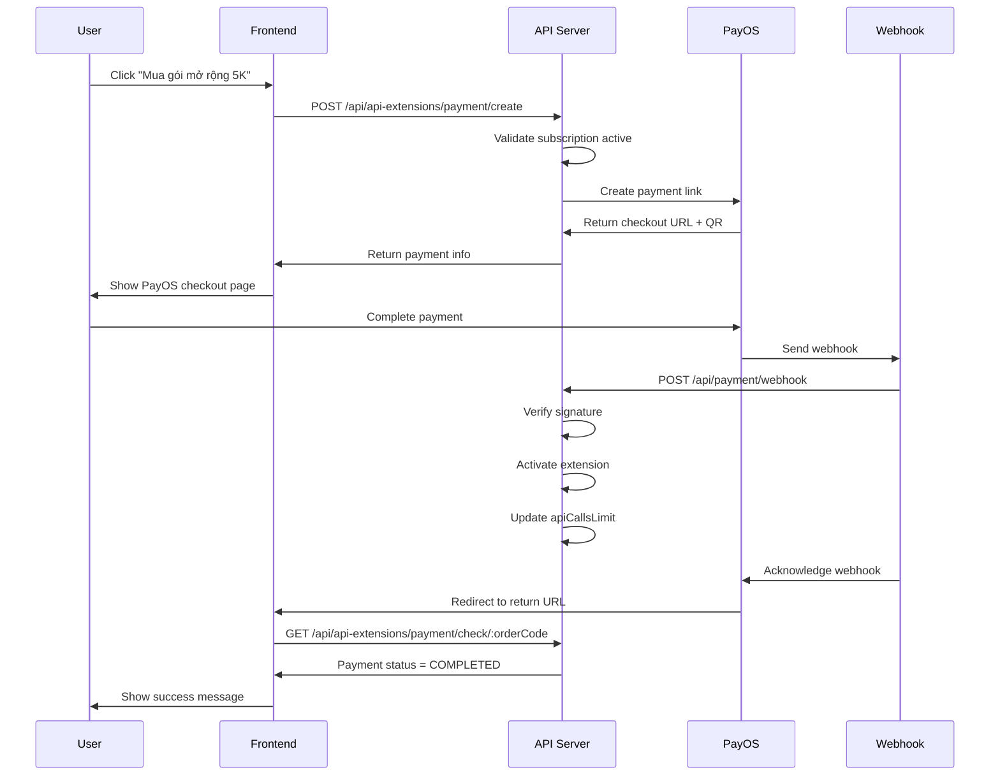

# Extension Payment Flow - PayOS Integration

Tài liệu chi tiết về payment flow cho API Extension Packages sử dụng PayOS.

---

## 🎯 Tổng quan

Gói mở rộng API giờ đây yêu cầu thanh toán qua PayOS giống như subscription packages, thay vì direct purchase như trước.

### Thay đổi so với trước:

**Trước (Direct Purchase):**
```
POST /api/api-extensions/purchase
→ Immediately activate extension
→ No payment verification
```

**Sau (PayOS Payment):**
```
POST /api/api-extensions/payment/create
→ Create PayOS payment link
→ User completes payment
→ PayOS webhook confirms payment
→ System activates extension
```

---

## 🔄 Payment Flow Diagram



---

## 📡 API Endpoints

### 1. Create Extension Payment

**POST** `/api/api-extensions/payment/create`

Tạo payment link để mua gói mở rộng.

**Authentication:** Required ✅

**Request:**
```json
{
  "extensionPackageId": "uuid-of-extension-package",
  "returnUrl": "https://yourapp.com/payment/success",
  "cancelUrl": "https://yourapp.com/payment/cancel"
}
```

**Response (201):**
```json
{
  "id": "payment-uuid",
  "orderCode": 1234567890,
  "amount": 199000,
  "currency": "VND",
  "description": "Thanh toán Gói Mở Rộng 5K",
  "status": "processing",
  "checkoutUrl": "https://pay.payos.vn/web/xxx",
  "qrCode": "data:image/png;base64,xxx",
  "paymentLinkId": "xxx",
  "package": {
    "id": "ext-uuid",
    "name": "Gói Mở Rộng 5K",
    "description": "Thêm 5,000 API calls",
    "additionalCalls": 5000
  }
}
```

**Errors:**
- **400**: Không có subscription active
- **400**: Subscription đã hết hạn
- **404**: Extension package không tồn tại

---

### 2. Check Payment Status

**GET** `/api/api-extensions/payment/check/:orderCode`

Kiểm tra trạng thái payment và cập nhật từ PayOS.

**Authentication:** Required ✅

**Response (200):**
```json
{
  "id": "payment-uuid",
  "orderCode": 1234567890,
  "amount": 199000,
  "status": "completed",
  "completedAt": "2025-10-05T10:30:00.000Z",
  "extensionId": "user-ext-uuid",
  "payosStatus": "PAID",
  "payosInfo": {
    "status": "PAID",
    "transactions": [...]
  }
}
```

---

### 3. Get Payment History

**GET** `/api/payment/user`

Xem tất cả payments (bao gồm subscriptions và extensions).

**Authentication:** Required ✅

**Response:**
```json
[
  {
    "id": "payment-uuid",
    "orderCode": 1234567890,
    "amount": 199000,
    "status": "completed",
    "paymentType": "extension",
    "description": "Thanh toán Gói Mở Rộng 5K",
    "completedAt": "2025-10-05T10:30:00.000Z",
    "extension": {
      "id": "ext-uuid",
      "extensionPackageName": "Gói Mở Rộng 5K",
      "additionalCalls": 5000
    }
  },
  {
    "id": "payment-uuid-2",
    "orderCode": 9876543210,
    "amount": 99000,
    "status": "completed",
    "paymentType": "subscription",
    "description": "Thanh toán gói Cơ Bản",
    "completedAt": "2025-10-01T08:00:00.000Z",
    "subscription": {
      "id": "sub-uuid",
      "packageName": "Gói Cơ Bản"
    }
  }
]
```

---

## 💻 Implementation Examples

### Frontend - React/TypeScript

```typescript
import { useState } from 'react';
import axios from 'axios';

interface ExtensionPaymentProps {
  extensionPackageId: string;
  extensionName: string;
  price: number;
}

function ExtensionPaymentButton({ 
  extensionPackageId, 
  extensionName, 
  price 
}: ExtensionPaymentProps) {
  const [loading, setLoading] = useState(false);

  const handlePurchase = async () => {
    setLoading(true);
    
    try {
      // 1. Create payment
      const response = await axios.post(
        '/api/api-extensions/payment/create',
        {
          extensionPackageId,
          returnUrl: `${window.location.origin}/payment/success`,
          cancelUrl: `${window.location.origin}/payment/cancel`,
        },
        {
          headers: {
            Authorization: `Bearer ${localStorage.getItem('token')}`,
          },
        }
      );

      const { checkoutUrl, orderCode } = response.data;

      // 2. Store orderCode for later status check
      localStorage.setItem('pendingPaymentOrderCode', orderCode.toString());

      // 3. Redirect to PayOS
      window.location.href = checkoutUrl;
    } catch (error) {
      console.error('Error creating payment:', error);
      alert('Không thể tạo thanh toán. Vui lòng thử lại.');
    } finally {
      setLoading(false);
    }
  };

  return (
    <button onClick={handlePurchase} disabled={loading}>
      {loading ? 'Đang xử lý...' : `Mua ${extensionName} - ${price.toLocaleString()}đ`}
    </button>
  );
}

export default ExtensionPaymentButton;
```

### Payment Success Page

```typescript
import { useEffect, useState } from 'react';
import { useNavigate } from 'react-router-dom';
import axios from 'axios';

function PaymentSuccessPage() {
  const [status, setStatus] = useState<'checking' | 'success' | 'failed'>('checking');
  const navigate = useNavigate();

  useEffect(() => {
    const checkPayment = async () => {
      const orderCode = localStorage.getItem('pendingPaymentOrderCode');
      
      if (!orderCode) {
        navigate('/dashboard');
        return;
      }

      try {
        // Check payment status
        const response = await axios.get(
          `/api/api-extensions/payment/check/${orderCode}`,
          {
            headers: {
              Authorization: `Bearer ${localStorage.getItem('token')}`,
            },
          }
        );

        if (response.data.status === 'completed') {
          setStatus('success');
          localStorage.removeItem('pendingPaymentOrderCode');
          
          // Redirect to dashboard after 3 seconds
          setTimeout(() => {
            navigate('/dashboard');
          }, 3000);
        } else if (response.data.status === 'failed' || response.data.status === 'cancelled') {
          setStatus('failed');
        } else {
          // Still processing, check again after 2 seconds
          setTimeout(checkPayment, 2000);
        }
      } catch (error) {
        console.error('Error checking payment:', error);
        setStatus('failed');
      }
    };

    checkPayment();
  }, [navigate]);

  if (status === 'checking') {
    return <div>Đang kiểm tra thanh toán...</div>;
  }

  if (status === 'success') {
    return (
      <div>
        <h1>✅ Thanh toán thành công!</h1>
        <p>Gói mở rộng đã được kích hoạt. Đang chuyển về dashboard...</p>
      </div>
    );
  }

  return (
    <div>
      <h1>❌ Thanh toán thất bại</h1>
      <button onClick={() => navigate('/dashboard')}>Quay lại Dashboard</button>
    </div>
  );
}

export default PaymentSuccessPage;
```

---

## 🗄️ Database Changes

### Updated `payments` Table

**New Columns:**
```sql
ALTER TABLE payments ADD COLUMN extension_id VARCHAR(255) NULL;
ALTER TABLE payments ADD COLUMN payment_type ENUM('subscription', 'extension') NOT NULL DEFAULT 'subscription';
ALTER TABLE payments ADD COLUMN package_id VARCHAR(255) NULL;

ALTER TABLE payments 
ADD CONSTRAINT FK_payments_extension_id 
FOREIGN KEY (extension_id) REFERENCES user_api_extensions(id) ON DELETE SET NULL;

CREATE INDEX IDX_payments_type ON payments(payment_type);
```

### Payment Type Enum

```typescript
export enum PaymentType {
  SUBSCRIPTION = 'subscription',
  EXTENSION = 'extension',
}
```

---

## 🔒 Security & Validation

### Before Creating Payment

1. ✅ User authenticated
2. ✅ User has active subscription
3. ✅ Subscription not expired
4. ✅ Extension package exists and active

### Webhook Processing

1. ✅ Verify PayOS signature
2. ✅ Check payment not already processed
3. ✅ Validate payment type
4. ✅ Call appropriate activation method

### Extension Activation

1. ✅ Find active subscription
2. ✅ Create user_api_extensions record
3. ✅ Update subscription.apiCallsLimit
4. ✅ Link payment to extension

---

## ⚠️ Error Handling

### Common Errors

| Error | Cause | Solution |
|-------|-------|----------|
| 400 - No active subscription | User chưa mua subscription | Mua subscription trước |
| 400 - Subscription expired | Subscription hết hạn | Gia hạn subscription |
| 404 - Package not found | Extension package ID sai | Kiểm tra package ID |
| 502 - PayOS error | PayOS service down | Thử lại sau |

### Handling Failed Payments

```typescript
// Frontend - Show retry option
if (payment.status === 'failed') {
  return (
    <div>
      <h2>Thanh toán thất bại</h2>
      <p>Lý do: {payment.failedReason}</p>
      <button onClick={retryPayment}>Thử lại</button>
      <button onClick={cancelPayment}>Hủy</button>
    </div>
  );
}
```

---

## 🧪 Testing

### Test Scenarios

#### 1. Happy Path
```
1. User có active subscription
2. Create payment → Success
3. Complete payment on PayOS
4. Webhook received → Extension activated
5. apiCallsLimit increased
```

#### 2. No Active Subscription
```
1. User không có subscription
2. Create payment → 400 Error
```

#### 3. Expired Subscription
```
1. User có subscription expired
2. Create payment → 400 Error
```

#### 4. Payment Cancelled
```
1. Create payment → Success
2. User cancels on PayOS
3. Webhook received → Status = cancelled
4. Extension NOT activated
```

### Test với Sandbox

```bash
# Create test payment
curl -X POST http://localhost:3000/api/api-extensions/payment/create \
  -H "Authorization: Bearer $TOKEN" \
  -H "Content-Type: application/json" \
  -d '{
    "extensionPackageId": "test-uuid",
    "returnUrl": "http://localhost:3001/success",
    "cancelUrl": "http://localhost:3001/cancel"
  }'

# Check payment status
curl http://localhost:3000/api/api-extensions/payment/check/1234567890 \
  -H "Authorization: Bearer $TOKEN"
```

---

## 📊 Monitoring

### Metrics to Track

1. **Payment Success Rate**: Completed / Total Created
2. **Average Payment Time**: Time from create to completed
3. **Failed Payment Reasons**: Group by failedReason
4. **Extension Activation Rate**: Activated / Completed Payments

### Log Points

```typescript
// Important log points
logger.log(`Extension payment created: orderCode=${orderCode}`);
logger.log(`Payment completed: orderCode=${orderCode}, extensionId=${extensionId}`);
logger.error(`Payment failed: orderCode=${orderCode}, reason=${reason}`);
logger.log(`Extension activated: +${additionalCalls} calls for user ${userId}`);
```

---

## 🚀 Migration Guide

### For Existing Installations

1. **Run migration:**
   ```bash
   npm run migration:run
   ```

2. **Update frontend:**
   - Change from POST `/purchase` to POST `/payment/create`
   - Add payment success page
   - Handle payment status checking

3. **Test thoroughly:**
   - Test với PayOS sandbox
   - Verify extension activation
   - Check apiCallsLimit updates

---

## 📝 Checklist

### Backend Setup
- [x] Update Payment entity
- [x] Create ApiExtensionPaymentService
- [x] Update webhook handler
- [x] Create migration
- [x] Update modules

### Frontend Setup
- [ ] Update purchase button to create payment
- [ ] Implement PayOS redirect
- [ ] Create payment success page
- [ ] Add payment status checking
- [ ] Handle errors gracefully

### Testing
- [ ] Test happy path
- [ ] Test error scenarios
- [ ] Test webhook processing
- [ ] Test extension activation
- [ ] Verify apiCallsLimit updates

---

## 🔗 Related Documentation

- [API Complete Documentation](./API_COMPLETE_DOCUMENTATION.md)
- [CHAT_API_V2](./CHAT_API_V2.md)
- [Payment Module](./src/payment/)

---

**Last Updated:** 2025-10-05  
**Version:** 2.0.1  
**Migration:** 1727950000011-UpdatePaymentForExtensions

